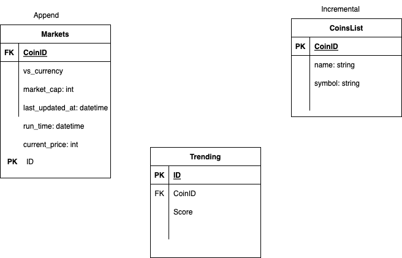
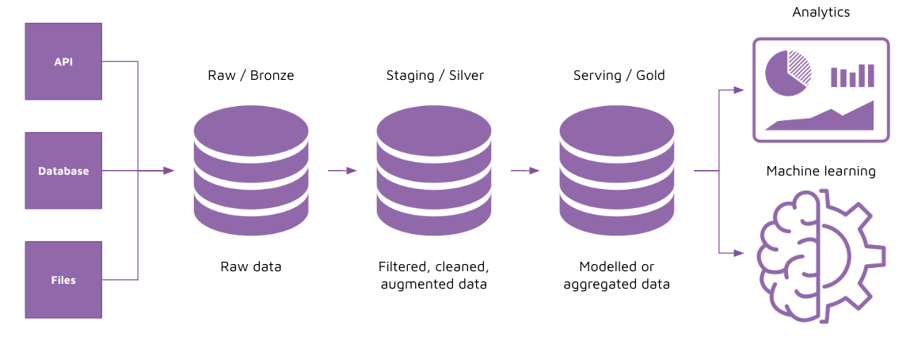

# Project plan 

## Objective 

Provide Crypto currency data for analysis.

 

# Source datasets 

## CoinGecko

- https://algotrading101.com/learn/coingecko-api-guide/
- https://www.coingecko.com/api/documentations/v3

 

# ERD (Sample)

 

# Pipeline

 

# Technologies
Just plain python and PostgreSQL Database.

