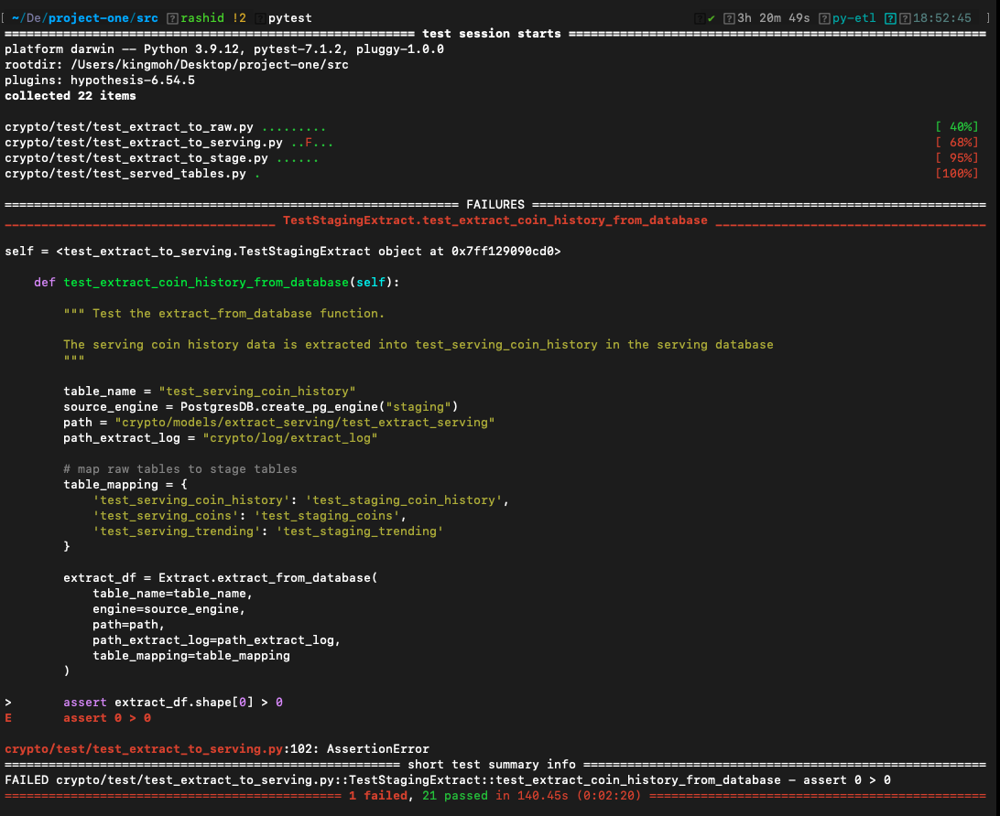
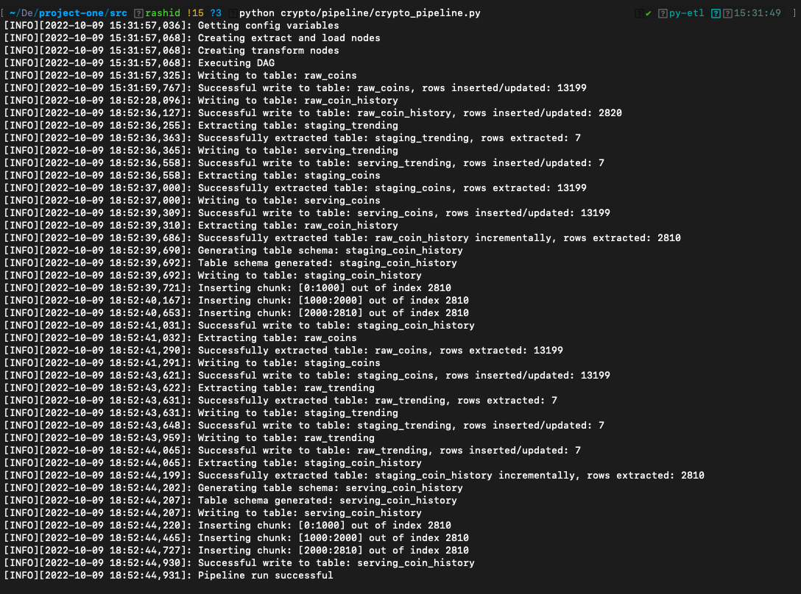

<br/>

# What has been done 

1. ELT pipeline has been completed.
2. An E2E has been provided 
3. The code is reproducible as long as three dbs namely - *raw*, *staging*, and *serving* are created.


<br/>

# What's outstanding 

1. Test/Code refactoring.
2. Add doctrings
3. Save watermark logs to DB
4. Format the `last_updated_timestamp` columns
5. Incremental extraction for API Extracts (nice to have)
6. Change `prints` to `log`
7. Better documentation of tests


<br/>

# Test the pipeline 

1. Set the python path by navigating to the `src/` directory and running the snippet below in the command line 

```bash 
. ./set_python_path.sh
```

<br/>


## Databases and connection vars

 
2. Create three databases namely: **raw**, **staging**, and **serving**. Then set the environment variables for database connections by reviewing and running  the `crypto/config.template.sh` script.

```bash 
. ./config.template.sh
```

Make sure the variables have been set by running ```echo $raw_db_user``` which should display 'postgres'


<br/>


## Run E2E test

Run the following command in the `src/` directory

```bash 
pytest
```

You'll notice that test tables have been created in all the databases. Some tests may fail if incremental extracts are enabled



<br/>

## Run the pipeline 

```bash 

python crypto/pipeline/crypto_pipeline.py 
```




<br/>

# Side Note 
https://docs.aws.amazon.com/IAM/latest/APIReference/API_Operations.html

<br/>

